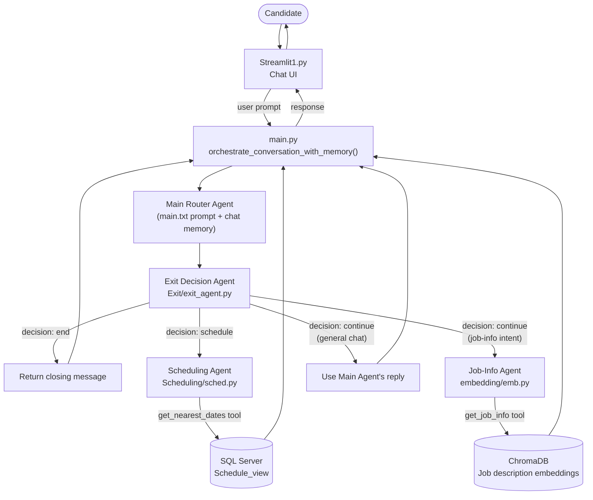

# HR Recruiter Agent 🚀

A Streamlit-based conversational agent that supports the recruitment process for a Python Developer role. It routes candidate messages between a scheduling agent, a job-info agent, and an exit-decision agent, backed by SQL Server and a local vector store.

## Table of Contents

- [Overview](#overview)
- [Key Features](#key-features)
- [Architecture & Flow Diagram](#architecture--flow-diagram)
- [Project Structure](#project-structure)
- [Module Reference](#module-reference)
- [Tech Stack](#tech-stack)
- [Prerequisites](#prerequisites)
- [Getting Started](#getting-started)
  - [1. Clone the Repository](#1-clone-the-repository)
  - [2. Install Dependencies](#2-install-dependencies)
  - [3. Prepare the Database](#3-prepare-the-database)
  - [4. Configure Environment Variables](#4-configure-environment-variables)
  - [5. Run the Project](#5-run-the-project)

## Overview

A candidate chats with the bot through a Streamlit UI. Every message is first handled by a **main router agent**, which decides whether the request is conversational, a scheduling request, or a job-info request. In parallel, an **exit decision agent** inspects the running transcript to decide whether the conversation should `continue`, move to `schedule`, or `end`. Based on that verdict, the message is dispatched to the **scheduling agent** (queries SQL Server for open interview slots) or the **job-info agent** (queries a Chroma vector index built from the job description PDF).

## Key Features

- **Schedule:** Finds and proposes interview slots based on candidate and recruiter availability (SQL Server-backed).
- **Info:** Answers candidate questions about the Python Developer role using embedded job-description content.
- **Exit:** Continuously evaluates the conversation to decide whether to keep going, move to scheduling, or end the chat.

## Architecture & Flow Diagram



**Flow summary:**
1. The Streamlit UI ([Streamlit1.py](app/modules/Streamlit1.py)) collects the candidate's prompt and forwards it to the orchestrator in [main.py](app/modules/main.py).
2. The **main router agent** produces a routing response using the running chat history.
3. The **exit decision agent** ([Exit/exit_agent.py](app/modules/Exit/exit_agent.py)) evaluates the transcript against few-shot examples and returns a `continue` / `schedule` / `end` verdict.
4. Depending on the verdict/intent, control passes to the **scheduling agent** ([Scheduling/sched.py](app/modules/Scheduling/sched.py)) or the **job-info agent** ([embedding/emb.py](app/modules/embedding/emb.py)); otherwise the main agent's own reply is used.
5. The resulting response is rendered back in the Streamlit chat window.

## Project Structure

```
New-Repository/
├── .env                          # Local environment variables (not committed)
├── requirements.txt               # Python dependencies
└── app/
    └── modules/
        ├── Streamlit1.py          # Streamlit chat UI (entry point)
        ├── main.py                # Orchestrator + main router agent
        ├── main.txt                # System prompt for the main router agent
        ├── exit.txt                # System prompt for the exit decision agent
        ├── schedule.txt            # System prompt for the scheduling agent
        ├── info.txt                # System prompt for the job-info agent
        ├── sms_conversations.json  # Few-shot transcript examples for the exit agent
        ├── prepDB.sql              # DB view + seed script for the scheduler
        ├── Exit/
        │   └── exit_agent.py       # ExitDecisionAgent (continue/schedule/end)
        ├── Scheduling/
        │   └── sched.py            # get_nearest_dates tool (SQL Server lookup)
        └── embedding/
            ├── emb.py              # get_job_info tool (Chroma vector search)
            └── Python Developer Job Description.pdf
```

## Module Reference

| Module | Role |
|---|---|
| [Streamlit1.py](app/modules/Streamlit1.py) | Renders the chat UI and calls the orchestrator for each user message. |
| [main.py](app/modules/main.py) | Boots the LLM, builds the vector index, wires up the router/scheduling/job agents, and orchestrates each turn. |
| [Exit/exit_agent.py](app/modules/Exit/exit_agent.py) | Classifies the conversation transcript into `continue`, `schedule`, or `end` using structured LLM output and few-shot examples from `sms_conversations.json`. |
| [Scheduling/sched.py](app/modules/Scheduling/sched.py) | LangChain tool `get_nearest_dates` — queries the `Schedule_view` SQL view for the 3 nearest available interview slots. |
| [embedding/emb.py](app/modules/embedding/emb.py) | Builds a Chroma index from the job description PDF at startup and exposes the `get_job_info` tool for semantic Q&A over it. |

## Tech Stack

- **Language:** Python 3.12+
- **UI:** Streamlit
- **Agent Framework:** LangChain / LangChain-Classic / LangGraph
- **LLM Provider:** OpenAI (`gpt-4o`, `gpt-4o-mini`, `text-embedding-3-small`)
- **Vector Store:** ChromaDB
- **Database:** SQL Server (via SQLAlchemy + pyodbc)
- **PDF Parsing:** PyPDF2

## Prerequisites

- Python 3.12+
- Access to a SQL Server instance
- An OpenAI API key

## Getting Started

### 1. Clone the Repository

```bash
git clone https://github.com/ronweinberg1-web/New-Repository.git
cd New-Repository
```

### 2. Install Dependencies

```bash
python -m venv .venv
.venv\Scripts\activate
pip install -r requirements.txt
```

### 3. Prepare the Database

1. Run `db_Tech.sql` to create the `tech` database and the `Schedule` table.
2. Run [app/modules/prepDB.sql](app/modules/prepDB.sql) to create the `Schedule_view` used by the scheduling agent and refresh the schedule data to current dates.
3. Create a DB user to be referenced in the `.env` file.

### 4. Configure Environment Variables

Copy `.env_sample` (at the project root) to `.env` and fill in the values:

```bash
cp .env_sample .env
```

The `.env` file must be at the project root with:

| Variable | Description |
|---|---|
| `OPENAI_API_KEY` | Your OpenAI API key |
| `DB_SERVER` | SQL Server host name |
| `DATABASE` | Database name (e.g. `tech`) |
| `DRIVER` | ODBC driver name (e.g. `ODBC+Driver+17+for+SQL+Server`) |
| `DB_USERNAME` | Database user |
| `DB_PASSWORD` | Database password |

### 5. Run the Project

```bash
cd app\modules
streamlit run Streamlit1.py
```

## Authors

- Yohay Asraf | ID: 03796841
- Meir Hayun | ID: 200842920
- Ron Weinberg | ID: 029367836
